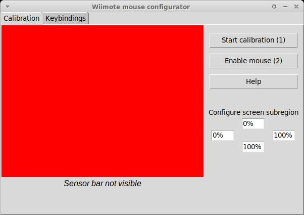
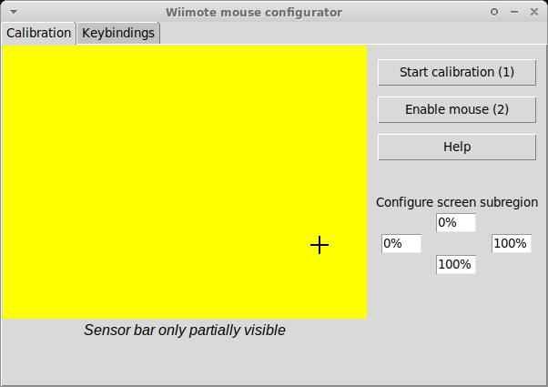
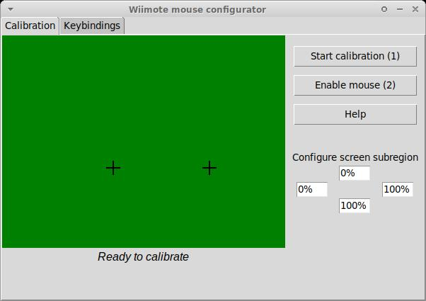
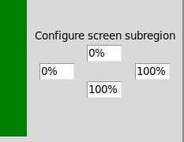
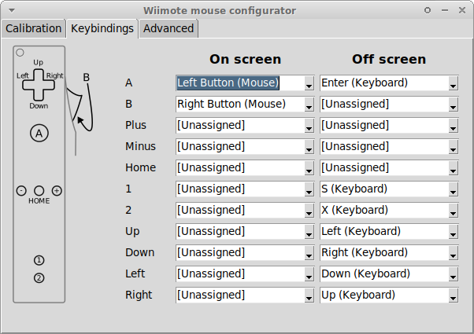

Configuration and calibration
=============================

xwiimote-mouse-driver comes with a python3-based configuration utility. The
utility enables users to:

- Calibrate the IR-sensor to match screen coordinates
- Map wiimote-buttons to arbitrary keyboard or mouse buttons

The configurator is defined in the file ``configurator.py`` and 
has the following python dependencies:

- Python tkinter (*might* need to be installed separately in some Linux distributions)
- `numpy <https://pypi.org/project/numpy/>`_

The configurator utility needs access to the xwiimote-mouse-driver's socket and 
a wiimote needs to be connected to the driver for the configurator to work. The
socket-path can configured through the commandline option ``--socket-path``:

.. code-block:: text

    usage: Wiimote mouse configurator [-h] [--socket-path SOCKET_PATH]

    Configuration tool for the xwiimote-mouse-driver

    options:
    -h, --help            show this help message and exit
    --socket-path SOCKET_PATH
                            Path to the socket to use for communication with the driver

When the tool is launched successfully, this window should appear:

Sensor bar setup
----------------

The calibration screen is used to create a mapping between where the wiimote 
is pointing and screen desktop coordinates. In order to calibrate the
xwiimote-mouse-driver, a `sensor bar <https://wiibrew.org/wiki/Sensor_Bar>`_
must be present, switched on, and placed *horizontally* in close proximity to 
the center of the screen. The best locations are shown in the following sketch:

.. image:: _static/2-conf-sensorbar-pos.png
    :height: 20em

To start the calibration, take your wiimote, and move to the location where
you intend to use the wiimote. Try if the sensorbar is sufficiently visible by
pointing the wiimote at your screen. You will see:

- A red screen (see above) meaning that the sensor bar is invisible
- A yellow screen with one black cross being displayed 
  meaning that the sensor bar is only _partially_ visible. Potential reasons:

    - The sensor bar is too far to the left/right of the view field of the 
      wiimote
    - The sensor bar is *too far away* from the wiimote, causing the two sides
      of the sensor bar to be viewed as one.
    - The sensor bar does not have enough power, if battery powered.   

- A green screen with two crosses indicating the location of the wiimote
  sensor bar as seen by the wiimote. When you see a green screen while pointing
  the wiimote at all four corners of your screen you have arranged your setup 
  correctly.

Calibration
-----------

Take your wiimote, stand or sit at the place where you intend to use it, and
press the (1)-button on the wiimote (or click the "Start Calibration (1)"). 
The text below the sensor preview will change to instructions text, follow 
these instructions. The steps in detail:

1. Point the wiimote at the sensor bar

     - During this step, the distance to the sensor bar is measured by measuring
       the distance between the left/right IR-spots. This is the only step in
       the calibration where it is important to have *both* points in view.

2. Point at the top-left corner of the screen
3. Point at the top-right corner of the screen
4. Point at the bottom-left corner of the screen
5. Point at the bottom-right corner of the screen
   
    - During this step, the coordinates of the wiimote-ir data are recorded to
      compute a `affine transformation (2d) <https://en.wikipedia.org/wiki/Affine_transformation>`_
      between between wiimote and screen coordinates.

After the last step is done, the calibration is finished. The calibration data
will be written into the configuration file of the xwiimote-mouse-driver by
the driver.

Screen subregion
----------------

If you only want to use the wiimote on a subregion of you screen area, for 
example, a single screen in a multi-screen setup, you will want to use the 
screen subregion configuration as well. This configuration shows four percentage
values in a top, left, bottom, and right position. These percentage values 
designate a region relative to the full screen area that the wiimote 
coordinates will be mapped to. 

Some example configurations for the top/left/bottom/right values:

- You have a left and a right monitor in your setup with the same resolution.
  You want to only use the left monitor, so the subregion should be configured
  as: 0%/0%/100%/50%
- You have three monitor with equal resolutions: a top-center,
  a bottom-left, and a bottom-right monitor. You want to use the top-center
  monitor, so the configuration should be: 0%/25%/50%/75%.
  
After the calibration was finished and the screen subregion was configured,
you can test your configration by pressing the (2) button on the wiimote to
temporarily enable the mouse.

Keybindings
-----------

On the keybindings-tab you can assign button maps for each wiimote button for
different situations.

The left column, "On Screen", defines the keybindings that will be used when a
valid ir signal is detected by the wiimote. The wiimote is "on screen". The
right column defines the keys that are in use when no valid ir signal is
detected by the wiimote. The wiimote is "off screen".

The two bindings allow for contextual rebinding of the wiimote buttons, 
for example, if the wiimote is held sideways. In you do not want to use this 
feature, just bind the same buttons for on screen and off screen.
