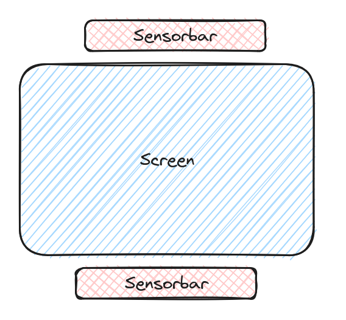

Configuration and calibration
=============================

xwiimote-mouse-driver comes with a python3-based configuration utility. The
utility enables users to:

- Calibrate the IR-sensor to match screen coordinates
- Map wiimote-buttons to arbitrary keyboard or mouse buttons

The configurator is defined in the file ``configurator.py`` and 
has the following python dependencies:

- Python tkinter (*might* need to be installed separately in some Linux distributions)
- `numpy <https://pypi.org/project/numpy/>`_

The configurator utility needs access to the xwiimote-mouse-driver's socket and 
a wiimote needs to be connected to the driver for the configurator to work. The
socket-path can configured through the commandline option ``--socket-path``:

.. code-block:: 

    usage: Wiimote mouse configurator [-h] [--socket-path SOCKET_PATH]

    Configuration tool for the xwiimote-mouse-driver

    options:
    -h, --help            show this help message and exit
    --socket-path SOCKET_PATH
                            Path to the socket to use for communication with the driver

When the tool is launched successfully, this window should appear:

Sensor bar setup
----------------

The calibration screen is used to create a mapping between where the wiimote 
is pointing and screen desktop coordinates. In order to calibrate the
xwiimote-mouse-driver, a `sensor bar <https://wiibrew.org/wiki/Sensor_Bar>`_
must be present, switched on, and placed *horizontally* in close proximity to 
the center of the screen. The best locations are shown in the following sketch:

To start the calibration, take your wiimote, and move to the location where
you intend to use the wiimote. Try if the sensorbar is sufficiently visible by
pointing the wiimote at your screen. You will see:

- A red screen (see above) meaning that the sensor bar is invisible
- A yellow screen with one black cross being displayed 
  meaning that the sensor bar is only _partially_ visible. Potential reasons:

    - The sensor bar is too far to the left/right of the view field of the 
      wiimote
    - The sensor bar is *too far away* from the wiimote, causing the two sides
      of the sensor bar to be viewed as one.
    - The sensor bar does not have enough power, if battery powered.   

- A green screen with two crosses indicating the location of the wiimote
  sensor bar as seen by the wiimote. When you see a green screen while pointing
  the wiimote at all four corners of your screen you have arranged your setup 
  correctly.

.. image:: _static/2-conf-fully-visible.jpg
    :height: 20em

Calibration
-----------

Keybindings
-----------
