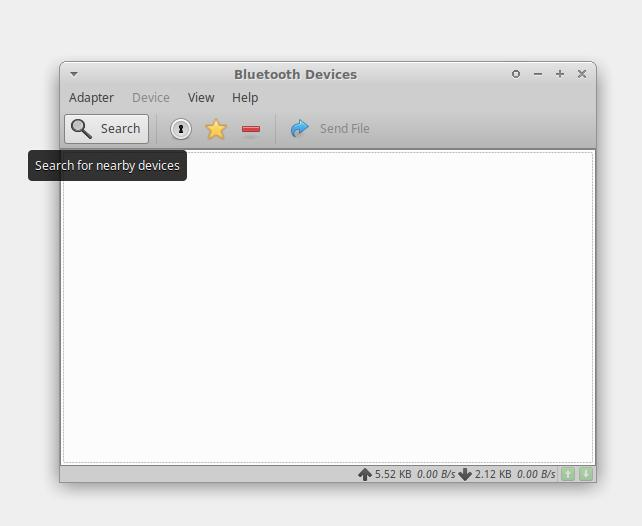
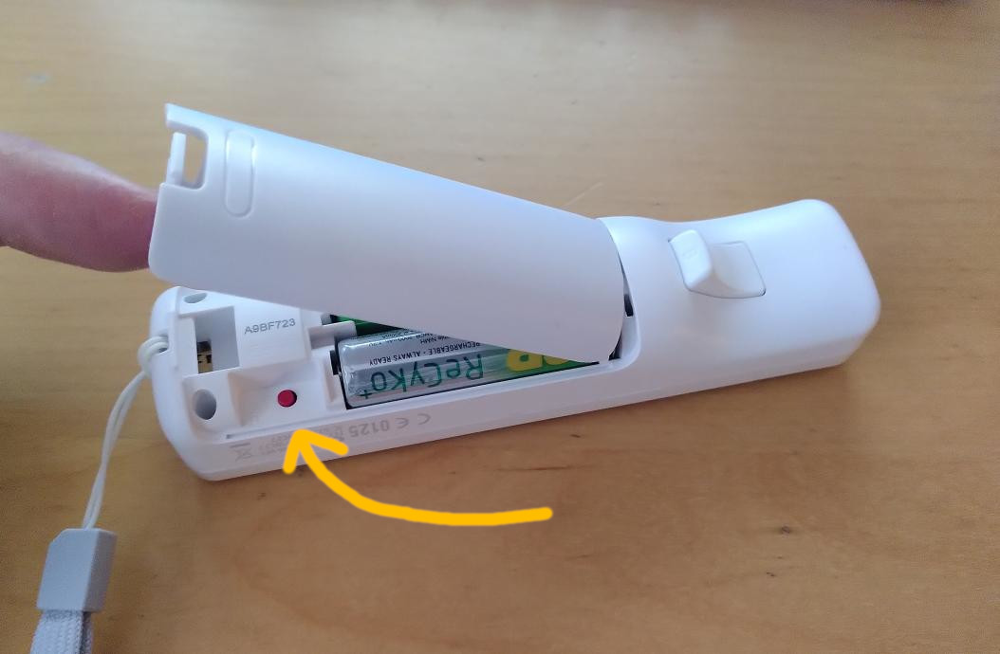
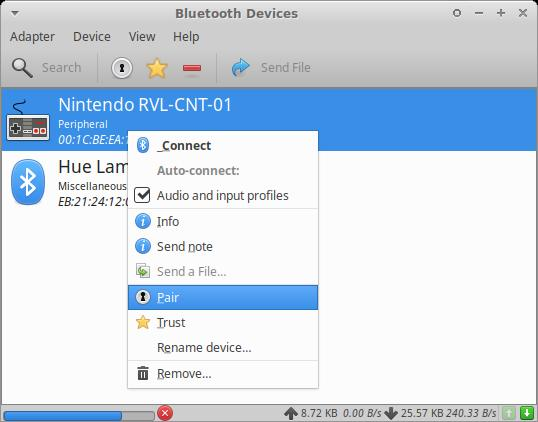
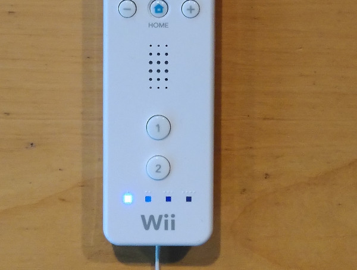

Setup
=====

This section describes the required steps to setup the wiimote 
mouse driver and have the mouse react to WiiMote inputs.

Install ``hid-wiimote`` kernel driver
-------------------------------------

The first step is to install the software that is *not included* in this 
project but is required for this project to run. The first item is the
kernel driver `hid-wiimote`. On Ubuntu, this driver is provided by the 
package `linux-modules-extra*`. Check your own distro to find details
on how to install this driver if it is not already present.

Install xwiimote-mouse-driver
-----------------------------

Download the binaries for Linux on your system. For the python-based
you will need to have python3 installed and the following python packages:

- tkinter
- numpy

On Ubuntu you can achieve this by issueing:

`sudo apt-get install python3 python3-tk python3-numpy`

Pair the WiiMote with your computer
-----------------------------------

By far the trickiest thing to get right in my experience. Here what
worked for me. Most of it consisted of doing the following steps
quickly(!):

1. Open your bluetooth-panel and get ready to press "scan for new devices"

2. Open the battery tray of the WiiMote and press the red pair-button.

3. Quickly hit the "search for new devices" button from (1).
4. Select "Pair" from the bluetooth menu and start mashing "A" on the WiiMote:

5. You are not done yet! When the "Connected"-message appears stop mashing
   the A button. Wait for a "Disconnected" message to appear in the bluetooth
   notification messages - about a second after the "Connected" message
   appeared.

6. Now right-click on the WiiMote device in the bluetooth manager and
   click "Connect". Also make sure that the "Audio and input profiles"
   checkmark is checked, otherwise the WiiMote will not work!
  
7. A "Connected" message should appear in the bluetooth notifications 
   after this and the WiiMote should remain connected. A single
   blue indicator light, replacing the flashing lights on the WiiMote
   indicates that the pairing suceeded:

8. Suggestion: Also press the "Trust" button (see image from point 4) so that
   the WiiMote quickconnect feature works!

Run the xwiimote-mouse-driver
-----------------------------

Now tha the Wiimote is connected to the computer, it is time to run the 
``xwiimote-mouse-driver`` command:

.. code-block:: text

    Usage: xwiimote-mouse-driver [options]
    Options:
        --socket-path=<path>  Path to the control socket
        --config-file=<path>  Path to the config file
        --help                Print this help message
        --version             Print the version number

In principle, no special arguments are needed to run the driver. By default,
a socket-file in the current directory will be created and the config file will
also be placed in the current directory. Both, socket and config file are
needed to do a persistent calibration of the wiimote to the screen the Wiimote
should be used on.

Using the ``--socket-path`` and ``--config-file`` options, it is possible to
move the files to a different location.

**Important:** There is *no way* right now to select a wiimote that
should be used as a mouse. The mouse-driver has a  auto-reconnect feature that
waits for a new wiimote to be connected if none is found. This means that the
driver grabs the first available wiimote and uses that one as a mouse. If
multiple wiimotes are connected to a system only one of the wiimotes will
be used and the other is ignored until the used wiimote is disconnected.

:doc:`Next steps: configuration and calibration <driverconfig>`